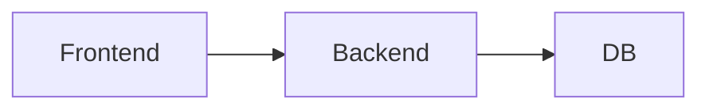

# 🚀 Arch

> Хакатон-проект команды

## 📌 О проблеме

_заполнить после кейса_

## 💡 Решение

_заполнить после кейса_

## 🏗 Как работает



## 🛠 Стек

_заполнить_

## 👥 Команда

| Роль | Участник |
|------|----------|
| Tech Lead | [@Dyman17](https://github.com/Dyman17) |
| Backend | [@RKydyrali](https://github.com/RKydyrali) |
| Frontend | [@yernurge](https://github.com/yernurge) |

## 📚 Документация

Все флоучарты и инструкции — в [docs/](docs/README.md)

## 🚀 Запуск

```bash
npm install
npm run dev
```
