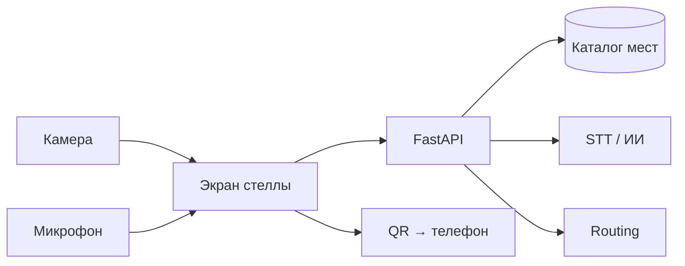

# 🚀 BaGdar

> Интерактивный туристический гид по Актау и Мангистау: городская стелла — карта, голос на языке туриста, маршрут, режим «Тогда и сейчас» (TarihSky).

## 📌 О проблеме

Турист в Актау не знает, куда сходить и как добраться. Приложение ставить лень, язык не всегда понятен, статичные таблички не отвечают.

## 💡 Решение

Стелла с экраном, микрофоном и камерой: подошёл → выбери место или спроси голосом → короткий ответ → карта приближает объект → маршрут от стелы, расстояние, время, стрелка → QR на телефон. Плюс TarihSky — сравнение «тогда и сейчас» для 2–3 мест.

## 🏗 Как работает



## 🛠 Стек

`React + TypeScript + Vite` · `MapLibre` · `Python FastAPI` · `каталог мест + статика` · `STT/LLM (ключи на сервере)` · `HuskyLens (опц.)`

## 👥 Команда

| Роль | Участник |
|------|----------|
| Tech Lead | [@Dyman17](https://github.com/Dyman17) |
| Backend | [@RKydyrali](https://github.com/RKydyrali) |
| Frontend | [@yernurge](https://github.com/yernurge) |

## 📚 Документация

| Док | Содержание |
|-----|------------|
| [docs/ideas.md](docs/ideas.md) | Идея и объём v1 |
| [docs/user-flow.md](docs/user-flow.md) | Подробные флоучарты |
| [docs/api-flow.md](docs/api-flow.md) | API-контракты |
| [docs/architecture.md](docs/architecture.md) | Архитектура |
| [docs/tasks.md](docs/tasks.md) | Задачи |
| [AGENTS.md](AGENTS.md) | Правила для команды и ИИ |

## 🚀 Запуск

```bash
# после инициализации backend/ и frontend/
# backend
cd backend && pip install -r requirements.txt && uvicorn app.main:app --reload
# frontend
cd frontend && npm install && npm run dev
```

_Точные команды — после создания структуры._
