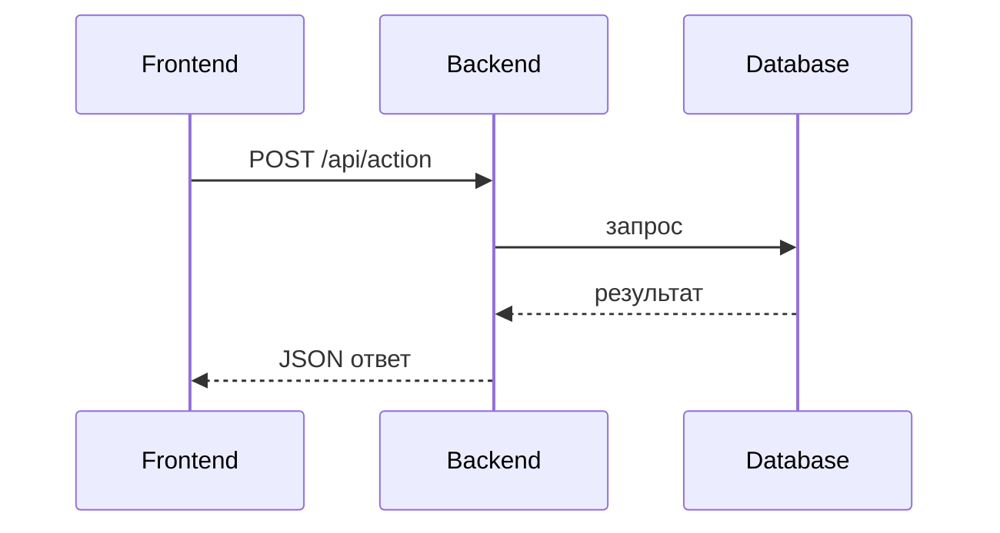
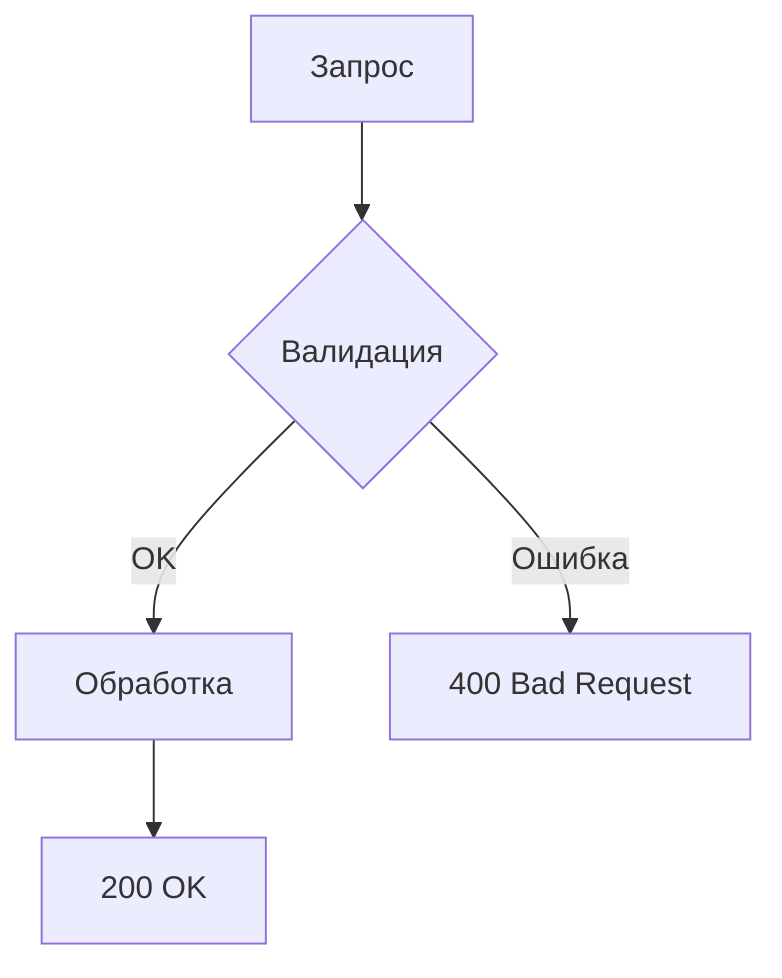

# ⚙️ API и бэкенд-логика

## Эндпоинты

| Метод | Путь | Описание |
|-------|------|----------|
| GET | `/api/...` | Получить данные |
| POST | `/api/...` | Создать/отправить |

## Логика запроса

## Обработка ошибок

---

_Заполни, когда будет кейс._
