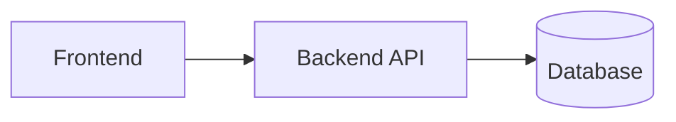

# 🏗 Архитектура

## Стек технологий

| Слой | Технология |
|------|-----------|
| Frontend | _заполнить_ |
| Backend | _заполнить_ |
| База данных | _заполнить_ |
| Деплой | _заполнить_ |

## Схема проекта



## Структура папок

```
Arch/
├── docs/           # документация (ты здесь)
├── frontend/       # фронтенд
├── backend/        # бэкенд
└── README.md
```

---

_Заполни, когда будет кейс._
