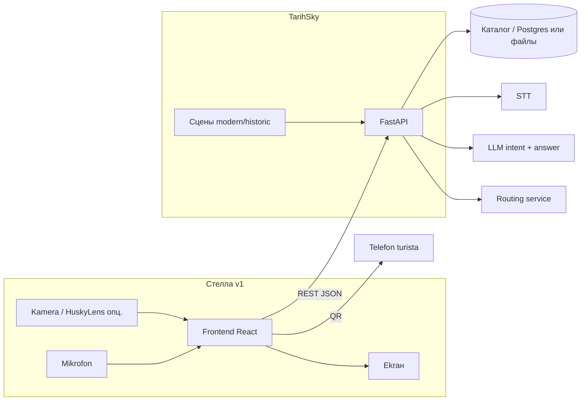
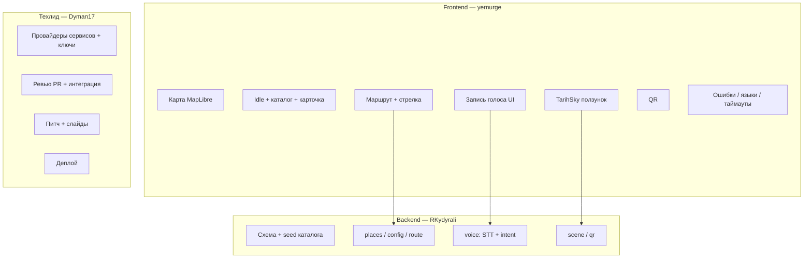

# 🏗 Архитектура — BaGdar

Интерактивная туристическая стелла по Актау и Мангистау: карта, голос, маршрут, TarihSky.

## Стек технологий

| Слой | Предложение | Ответственный |
|------|-------------|---------------|
| Frontend | **React + TypeScript + Vite**, MapLibre GL, анимации | @yernurge |
| Backend | **Python + FastAPI** | @RKydyrali |
| Данные | Каталог мест + статические изображения (seed) | @RKydyrali + техлид |
| AI | STT + LLM (intent/саммари) — ключи на сервере | @RKydyrali |
| Routing | Сервис пеших маршрутов (выбор — техлид) | @RKydyrali |
| Оборудование | Ноутбук/мини-ПК + экран + микрофон; **HuskyLens по готовности** | hardware |

## Схема



## Структура папок

```
Arch/
├── docs/
├── frontend/          # React + TS + Vite (экраны стеллы)
├── backend/           # FastAPI, каталог, voice, route, scene, qr
├── hardware/          # HuskyLens / макет (после стабильного MVP)
├── data/
│   ├── places/        # seed мест
│   └── scenes/        # 2–3 сцены TarihSky
└── README.md
```

## Ключевые решения

1. **Точка и heading стеллы заданы заранее** (`/api/config`) — стрелка без слежения за телом
2. **Камера не обязательна для v1** — весь сценарий работает касанием; HuskyLens = приветствие, потом
3. **MVP без:** сувенирного фото, погоды, озвучки, gaze/gesture, генерации реконструкций в рантайме
4. **Ключи только на сервере**
5. **Каталог проверенный** — ИИ не выдумывает места, только intent → place_id из seed

## Разделение работ



## Порядок разработки

1. Утвердить: точку, объекты, языки, демо-сценарий
2. Зафиксировать архитектуру, задачи, API (✅ в docs/)
3. Карта → карточка → маршрут → QR
4. Текстовый вопрос → затем голос
5. Исторические сцены + переходы
6. Сборка на устройстве + полный сценарий с людьми
7. HuskyLens, если основное стабильно

## Критерий готовности

Человек впервые видит стеллу → спрашивает или выбирает → понимает направление → открывает TarihSky → QR на телефон. Демо **на целевом устройстве**; при ошибке речи всё главное доступно касанием.

---

_API: [api-flow.md](api-flow.md). Флоучарты: [user-flow.md](user-flow.md). Задачи: [tasks.md](tasks.md)._
