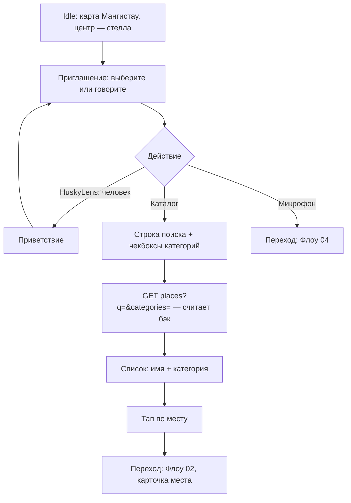

# Флоу 01. Карта + каталог

> 🔒 Заморожено. Правки только через техлида (@Dyman17). Изменение 24.09: Leaflet+OSM, границы Мангистау, поиск и мультифильтры на бэке.

Поиск места касанием. Входная точка стеллы. Самая важная часть системы.

## Карта

- **Leaflet** + тайлы OSM (`tile.openstreetmap.org`, без ключа) + атрибуция
- Карта ограничена **Мангистау**: bounds [[42.3, 50.0], [45.9, 54.6]], minZoom 7
- Маркер стеллы + кликабельные точки мест

## Флоучарт

## Контракт

- `GET /api/config` → точка стелы, языки, режимы, таймауты, `categories`
- `GET /api/places?lang=&q=&categories=&limit=` → поиск по имени/описанию + мультифильтр OR, `total` после фильтров

Полные JSON — в [../api/backend.md](../api/backend.md#флоу-1-карта--каталог).

## Состояния UI

`idle` → `greeting` → `catalog` → (выбор) → `place_card`

## Ошибки

- API недоступен → каталог из кэша последнего успешного списка + баннер
- Пустой список → «мест нет, спросите голосом» → Флоу 04

## DoD куска

Карта открывается на стелле, точки кликабельны, тап ведёт на карточку (можно с мок-данными до готовности бэка).
