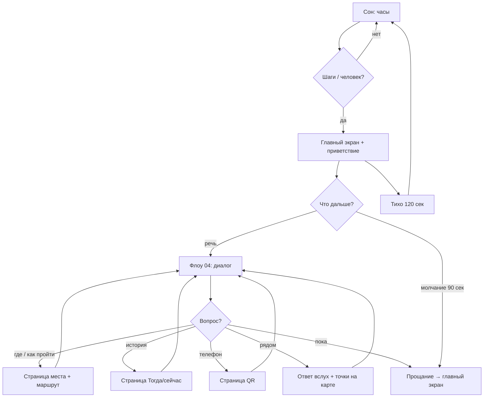

# Флоу 01. Главный: пришёл → экран → заговорил → страницы

> 🔒 Заморожено. Правки только через техлида (@Dyman17).

Основной флоу системы. Человек приходит → шаги будят экран → речь запускает диалог → по вопросам открываются страницы.

## Пороги звука (dBFS, калибрует техлид)

| Уровень | Значение | Что значит | Реакция |
|---------|----------|------------|---------|
| Фон | < −42 | никого нет | сон / idle |
| Шаги | −42…−30, 3 кадра | человек подходит | **главный экран** |
| Речь | > −30, 3 кадра | человек говорит | **диалог** |

Человек в кадре камеры = то же, что шаги. Гистерезис 8 дБ везде.

## Точные правила

| # | Правило |
|---|---------|
| 1 | Сон/тишина + шаги/человек → главный экран: карта района + короткое приветствие вслух («Здравствуйте! Спросите меня») |
| 2 | Главный экран ждёт речь. Ничего не открывает сам |
| 3 | Речь → `POST /dialog/turn` → диалог (Флоу 04): отвечает как ИИ + возвращает `actions` |
| 4 | По вопросам открываются страницы: место+маршрут (02), история (05), QR (03) |
| 5 | Речь кончилась + молчание 90 сек → прощание → главный экран |
| 6 | Тихо 120 сек + пустой кадр → сон (часы) |
| 7 | Ушёл не попрощавшись → следующий громкий звук после тишины = новый человек = новый `session_id` |

## Флоучарт

## Контракт

- Пробуждение/речь: только уровни + камера, эндпоинтов нет (всё локально на фронте)
- Диалог: `POST /api/dialog/turn` (см. Флоу 04)
- Показы: `places/{id}`, `route`, `scene`, `qr` (см. 02/03/05)

## DoD куска

Шаги → экран за <1 сек. Речь → ответ за <3 сек. Страницы открываются по смыслу вопроса. Уход → сброс.
