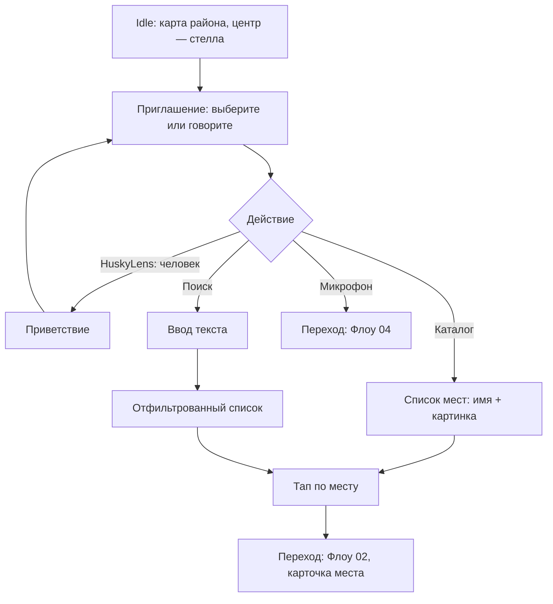

# Флоу 01. Карта + каталог

> 🔒 Заморожено. Правки только через техлида (@Dyman17).

Поиск места касанием. Входная точка стеллы.

## Флоучарт

## Контракт

- `GET /api/config` → точка стелы, языки, режимы, таймауты
- `GET /api/places?lang=&bbox=&limit=` → список мест для карты и каталога

Полные JSON — в [../api/backend.md](../api/backend.md#флоу-1-карта--каталог).

## Состояния UI

`idle` → `greeting` → `catalog` → (выбор) → `place_card`

## Ошибки

- API недоступен → каталог из кэша последнего успешного списка + баннер
- Пустой список → «мест нет, спросите голосом» → Флоу 04

## DoD куска

Карта открывается на стелле, точки кликабельны, тап ведёт на карточку (можно с мок-данными до готовности бэка).
