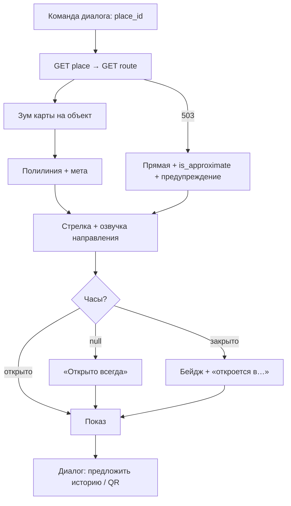

# Флоу 02. Показ места + маршрут

> 🔒 Заморожено. Правки только через техлида (@Dyman17).

Показ по команде диалога. Кнопок нет.

## Точные правила

| # | Правило |
|---|---------|
| 1 | Диалог вернул `place_id` → фронт запрашивает `GET places/{id}` → `GET route` → показывает |
| 2 | На экране: фото, название (на языке сеанса), 1–2 предложения, часы (`null` = «открыто всегда») |
| 3 | Маршрут: линия OSRM + `distance_m` + `duration_min` + стрелка `(bearing − heading)` + текст направления — всё озвучивается |
| 4 | `mode: transit` → озвучить способ поездки + точку посадки |
| 5 | `is_approximate` → показать и сказать «примерный путь» |
| 6 | После показа диалог спрашивает: «Показать историю? Отправить на телефон?» (если уместно) |
| 7 | Routing упал → прямая линия, диалог предупреждает голосом |

## Флоучарт

## Контракт

- `GET /api/places/{id}`, `GET /api/places/{id}/route?mode=&fallback=`

## DoD куска

Показ открывается за <2 сек после команды, стрелка верна относительно стелы, всё дублируется голосом.
