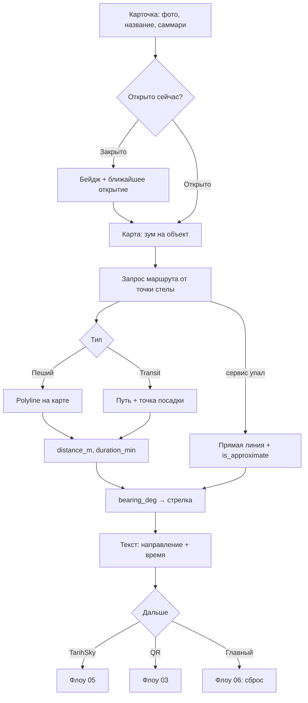

# Флоу 02. Карточка места + маршрут

> 🔒 Заморожено. Правки только через техлида (@Dyman17). Изменение 24.09: `hours: null` для уличных мест, стрелка относительно heading стелы.

Детали места, путь от стелы, стрелка направления.

## Флоучарт

## Контракт

- `GET /api/places/{id}` → детали + `is_open_now` + `has_scene` + `access`
- `GET /api/places/{id}/route?mode=walk` → `distance_m`, `duration_min`, `bearing_deg`, `geometry`, `steps`
- Фоллбэк: `GET .../route?fallback=1` → прямая, `is_approximate: true`
- Ошибка: `503 ROUTE_UNAVAILABLE`

Полные JSON — в [../api/backend.md](../api/backend.md#флоу-2-карточка-места--маршрут).

## Правила

- Точка и heading стелы — из `config.origin`. Стрелку считает бэк (`bearing_deg`), фронт только рисует
- **Стрелка на экране = `bearing_deg − heading_deg`** (поворот относительно стелы, не севера)
- `hours: null` → «Открыто всегда», бейдж закрытия не показывать
- `mode: transit` → иконка 🚌/🚕, шаги включают точку посадки
- Слежения за телом в v1 нет

## DoD куска

Карточка открывается, маршрут рисуется, стрелка указывает, время/расстояние показаны. При убитом routing — прямая + пометка.
