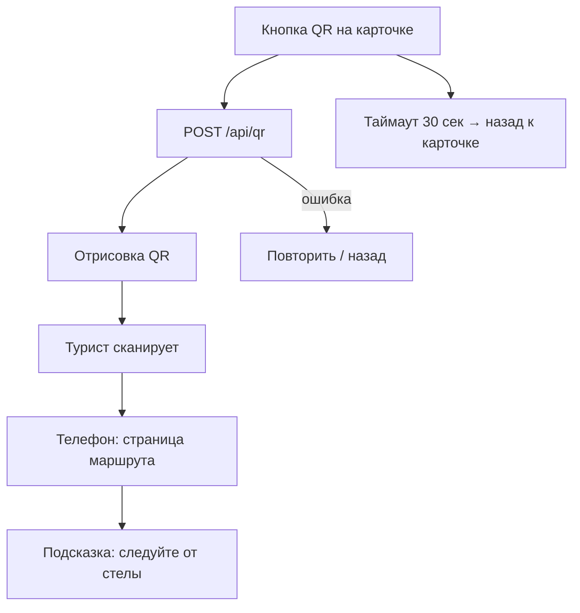

# Флоу 03. QR на телефон

> 🔒 Заморожено. Правки только через техлида (@Dyman17).

Маршрут забирают на телефон.

## Флоучарт

## Контракт

- `POST /api/qr` `{ place_id, lang, session_id }` → `{ url, payload_version, expires_in_sec }`

Полный JSON — в [../api/backend.md](../api/backend.md#флоу-3-qr).

## DoD куска

QR рисуется, сканируется тестовым телефоном, страница открывается.
