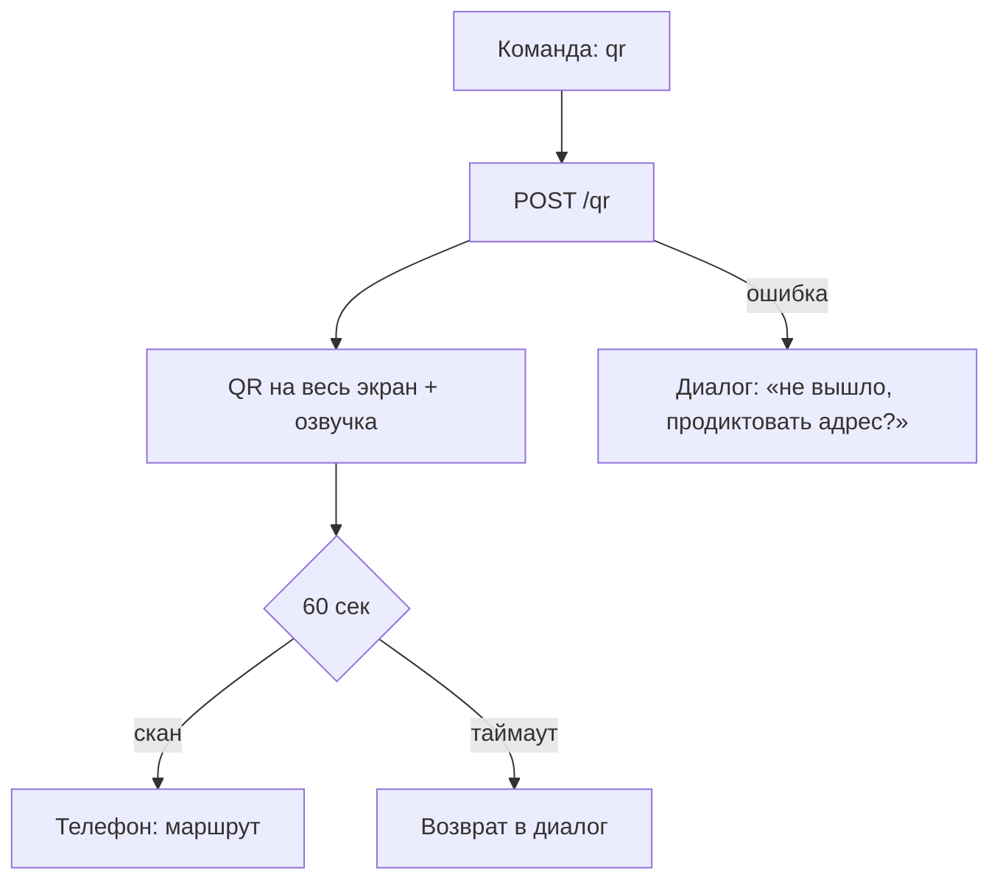

# Флоу 03. Показ QR

> 🔒 Заморожено. Правки только через техлида (@Dyman17).

Показ по команде «отправь на телефон». Кнопки нет.

## Точные правила

| # | Правило |
|---|---------|
| 1 | Диалог вернул action `qr` → фронт `POST /qr` → крупный QR на весь экран |
| 2 | Диалог озвучивает: «Сканируйте — маршрут откроется на телефоне» |
| 3 | Таймаут 60 сек → возврат в диалог («Показать что-то ещё?») |
| 4 | Страница `/r/:token`: место, путь, шаги, кнопки Google Maps / 2ГИС |
| 5 | Токен одноразовый по сути (TTL 3600), в БД |

## Флоучарт

## Контракт

- `POST /api/qr` `{ place_id, lang, session_id }` → `{ url, expires_in_sec }`

## DoD куска

QR сканируется с 2 метров, страница открывается, таймаут возвращает в диалог.
