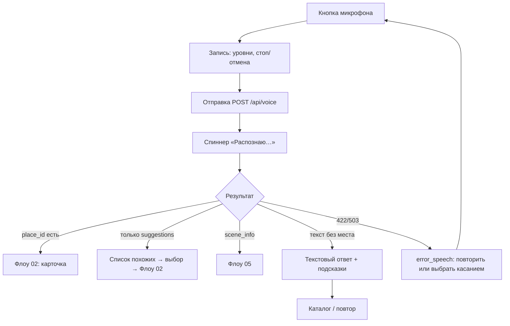

# Флоу 04. Голос

> 🔒 Заморожено. Правки только через техлида (@Dyman17).

Вопрос на языке туриста → место или ответ.

## Флоучарт

## Контракт

- `POST /api/voice` `{ session_id, lang: auto|ru|en|kk, mode: nav|scene, audio_b64, mime, text?, context? }`
- Ответ: `{ lang, intent, place_id?, answer, need_route, need_scene, suggestions[] }`
- Ошибки: `422 SPEECH_UNRECOGNIZED`, `503 AI_UNAVAILABLE`
- Лимит аудио: 15 с

Полные JSON — в [../api/backend.md](../api/backend.md#флоу-4-голос).

## Правила

- STT/LLM — только на сервере, ключи в `.env`
- `mode: scene` — вопрос по открытой TarihSky-сцене
- При ошибке речи касание всегда доступно (деградация обязательна)

## DoD куска

Голос на 2 языках находит место из каталога; при неразборчивом — экран повтора, касание работает.
