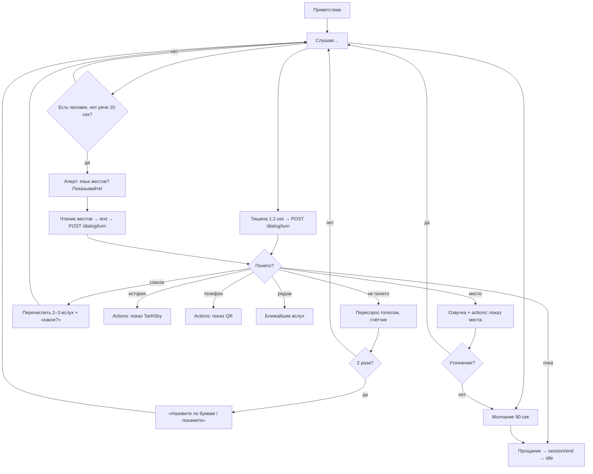

# Флоу 04. Голосовой диалог (ядро системы)

> 🔒 Заморожено. Правки только через техлида (@Dyman17).

Единственный пульт управления. Мозг — `POST /api/dialog/turn` (форма ниже, контракты на синхронизации).

## Точные правила

| # | Правило |
|---|---------|
| 1 | Вход: звук выше порога или человек в кадре → приветствие → слушаю |
| 2 | Конец реплики = тишина 1.2 сек → отправка терна |
| 3 | Язык — только автоопределение. Основные kk/ru/en, остальные через LLM |
| 4 | Ответ всегда: озвучка (TTS, когда будет; пока субтитры + короткий текст) + показ |
| 5 | Не понято → переспрос голосом (макс 2 раза) → предложить «покажите / назовите по буквам» |
| 6 | Молчание 90 сек → прощание → idle. Прощание («пока», «спасибо») → `session/end` |
| 7 | Человек есть, речи нет 10 сек → алерт про жесты (см. ниже) |
| 8 | LLM возвращает только `place_id` из каталога. Выдуманных мест нет |

## Флоучарт



## Команды диалога

| Фраза | Действие |
|---|---|
| «Как пройти / где …» | место + маршрут |
| «Что рядом / что посмотреть» | ближайшие вслух |
| «Покажи как было / история» | TarihSky |
| «Отправь на телефон» | QR |
| «Спасибо / пока / всё» | прощание → end |

## Память сеанса (сброс на каждого пользователя)

| Поле | Зачем |
|------|-------|
| `lang` | язык ответов |
| `places[]` | о чём говорили («а что рядом с ним?») |
| `last_intent` | маршрут? история? |
| `turns[]` | последние реплики для контекста |
| `prefs` | «люблю историю» → предлагать такое |

Живёт на сервере по `session_id`. Сброс: прощание, 90 сек молчания, сон, новый голос после тишины. Между людьми — только анонимные счётчики (приватность).

## Жесты (немые)

- Триггер: человек рядом, речи нет 10 сек → алерт на экране
- MediaPipe Hands (21 точка) → текст → тот же `POST /dialog/turn` с полем `signs`
- Старт: «да», «нет», «спасибо», цифры. Полный язык — roadmap

## Автовключение

- Порог −30 dBFS (калибрует техлид), гистерезис 8 дБ, 3 кадра

## Контракт (мозг, на синхронизации с backend.md)

```
POST /api/dialog/turn
← { session_id, lang: auto, audio_b64?, text?, signs? }
→ { lang, say, place_id?, actions: [{show: map|route|scene|qr}], suggestions[], memory_patch, debug: {via} }
```

Ошибки: `422 SPEECH_UNRECOGNIZED` → переспрос; `503 AI_UNAVAILABLE` → переспрос + упрощение; `429 RATE_LIMITED` (10/мин) → «подождите немного».

## DoD куска

Диалог без касаний end-to-end: вопрос → ответ → уточнение → команда → прощание. Переспрос ≤2. Жестовый алерт срабатывает.
