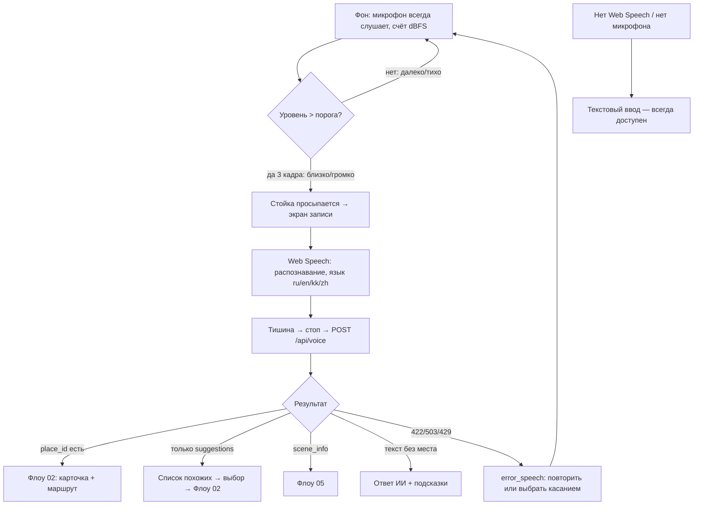

# Флоу 04. Голос

> 🔒 Заморожено. Правки только через техлида (@Dyman17). Изменение 24.09: автовключение по громкости, любой язык через LLM, rate-limit.

Вопрос на языке туриста → место или ответ. Кнопки вкл/выкл микрофона нет.

## Флоучарт

## Автовключение (калибровка на месте)

- Порог по умолчанию **−30 dBFS**, слайдер −50…−10 на idle-экране + живой метр
- Гистерезис 8 дБ (взвод после тишины), 3 кадра (~180 мс) против ложных хлопков
- Ориентиры: комната −50…−40, речь рядом −20…−12

## Контракт

- `POST /api/voice` `{ session_id, lang: auto|ru|en|zh, mode: nav|scene, audio_b64?, text?, context? }`
- Ответ: `{ lang, intent, place_id?, answer, need_route, need_scene, suggestions[], debug: { stt_text, via: llm|rules } }`
- Язык ответа = язык туриста (LLM; без ключа — правила + русский)
- Ошибки: `422 SPEECH_UNRECOGNIZED`, `503 AI_UNAVAILABLE`, **`429 RATE_LIMITED` (10/мин на сессию)**
- Лимит аудио: 15 с

Полные JSON — в [../api/backend.md](../api/backend.md#флоу-4-голос).

## Правила

- STT в черновике — браузерный (Web Speech), серверный STT — следующим слоем
- LLM: `backend/app/llm.py`, Gemini или GPT-4o-mini, ключ в `.env`; без ключа — тихий фоллбэк
- LLM возвращает только `place_id` из каталога — места не выдумываются
- `mode: scene` — вопрос по открытой TarihSky-сцене
- При ошибке речи касание всегда доступно

## DoD куска

Голос на ru/en/zh находит место; китайский — после B7; при неразборчивом — экран повтора, касание работает.
