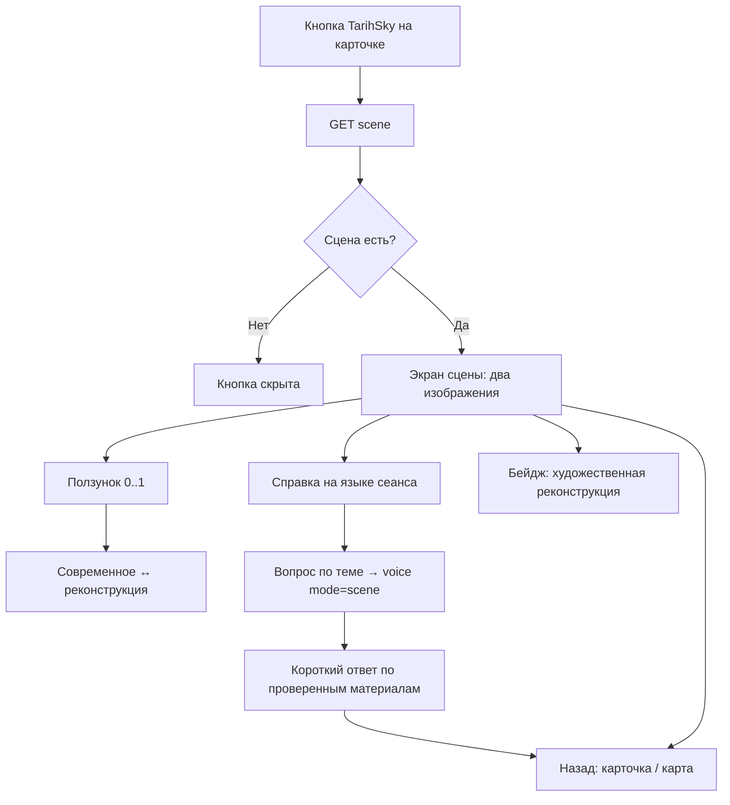

# Флоу 05. TarihSky — «Тогда и сейчас»

> 🔒 Заморожено. Правки только через техлида (@Dyman17). Изменение 24.09: сцены из БД, список сцен.

Историческая сцена места с ползунком. Главный wow-эффект.

## Флоучарт

## Сцены (из БД, `scenes`)

| # | Место | Статус контента |
|---|-------|-----------------|
| 1 | Набережная | тексты-заглушки, фото нет |
| 4 | Форт Шевченко | тексты-заглушки, фото нет |
| 6 | Шакпак-ата | тексты-заглушки, фото нет |

**Решение команды (0.4):** по финальному доку — одна сцена идеально (Маяк / старая набережная / караван-сарай), а не три посредственно. Ракурсы modern/historic должны совпадать.

## Контракт

- `GET /api/places/{id}/scene` → `{ modern_url, historic_url, attribution, texts{ru,en,zh}, sources[] }`
- `404 PLACE_NOT_FOUND` → скрыть кнопку
- Вопросы по сцене — `POST /api/voice` с `mode: scene` (см. Флоу 04)

Полный JSON — в [../api/backend.md](../api/backend.md#флоу-5-tarihsky).

## Правила v1

- Генерации реконструкций в рантайме нет
- Реконструкция всегда подписана как художественная
- Тексты справок — только проверенные материалы (источники в `sources`)

## DoD куска

Ползунок плавно переключает, текст на языке сеанса, возврат работает, 1 сцена с реальными фото.
