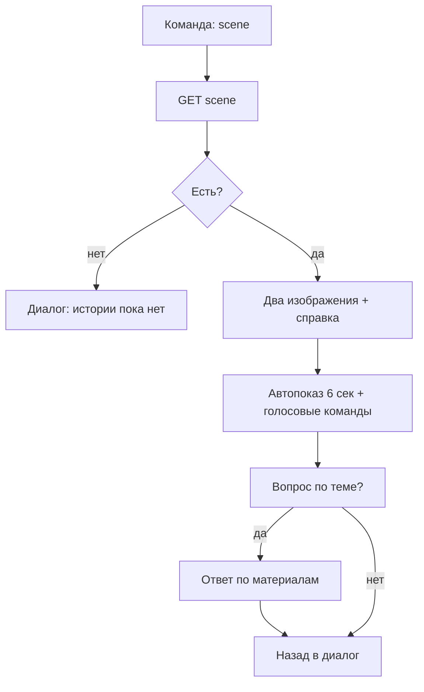

# Флоу 05. Показ «Тогда и сейчас»

> 🔒 Заморожено. Правки только через техлида (@Dyman17).

Показ по команде «покажи как было». Кнопки нет. Главный wow-эффект.

## Точные правила

| # | Правило |
|---|---------|
| 1 | Диалог вернул action `scene` → фронт `GET scene` → экран сцены |
| 2 | Ползунок двигается голосом («дальше», «назад», «середина») + медленный автопоказ за 6 сек |
| 3 | Справка озвучивается (TTS; пока субтитры), бейдж «художественная реконструкция» всегда виден |
| 4 | Вопрос по теме → `voice mode=scene` → короткий ответ по проверенным материалам |
| 5 | Нет сцены → диалог не предлагает, команда отвечает «у этого места пока нет истории» |
| 6 | Конец → возврат в диалог («что ещё показать?») |

## Флоучарт

## Сцены (БД)

| # | Место | Контент |
|---|-------|---------|
| 1 | Набережная | заглушка → заменить |
| 4 | Форт Шевченко | заглушка → заменить |
| 6 | Шакпак-ата | заглушка → заменить |

Решение 0.4: одна сцена идеально (Маяк / старая набережная / караван-сарай), ракурсы совпадают.

## Контракт

- `GET /api/places/{id}/scene` → `{ modern_url, historic_url, attribution, texts, sources[] }`
- `404` → диалог говорит, что истории нет

## DoD куска

Показ идёт сам + слушается команд, возврат в диалог, 1 сцена с реальными фото.
