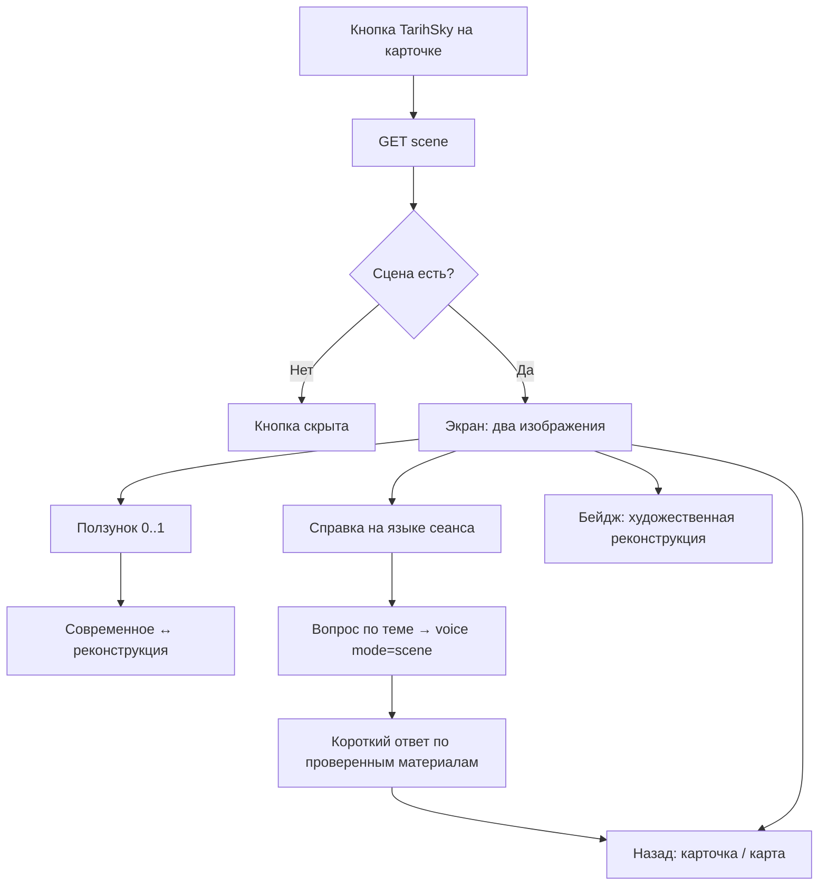

# Флоу 05. TarihSky — «Тогда и сейчас»

> 🔒 Заморожено. Правки только через техлида (@Dyman17).

Историческая сцена места с ползунком.

## Флоучарт

## Контракт

- `GET /api/places/{id}/scene` → `{ modern_url, historic_url, attribution, texts{ru,en,kk}, sources[] }`
- `404 PLACE_NOT_FOUND` → скрыть кнопку
- Вопросы по сцене — `POST /api/voice` с `mode: scene` (см. Флоу 04)

Полный JSON — в [../api/backend.md](../api/backend.md#флоу-5-tarihsky).

## Правила v1

- 2–3 сцены, одинаковый ракурс, готовим заранее
- Генерации реконструкций в рантайме нет
- Реконструкция всегда подписана как художественная

## DoD куска

Ползунок плавно переключает изображения, текст на языке сеанса, возврат работает.
