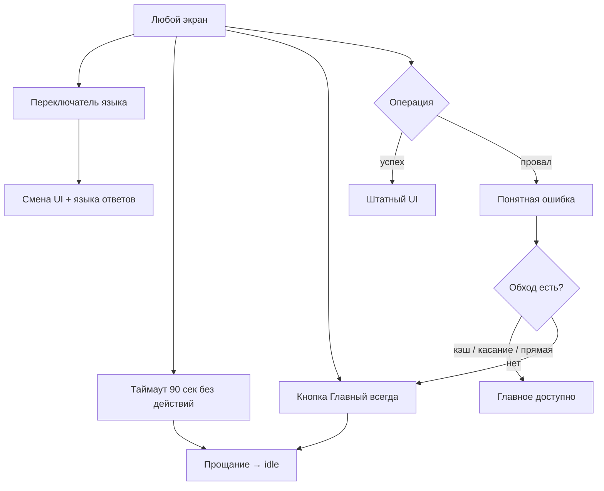

# Флоу 06. Сеанс: языки, таймауты, ошибки

> 🔒 Заморожено. Правки только через техлида (@Dyman17).

Покрывает все остальные флоу.

## Флоучарт

## Контракт

- `POST /api/session/end` `{ session_id }` → `{ ok: true }` (опц., фронт может сбрасываться локально)
- `GET /api/health` → `{ status, db, route_provider, ai, version }`

## Таблица деградации

| Ситуация | Поведение |
|----------|-----------|
| STT не понял | error_speech + «выбрать на карте» |
| Нет сети / API down | баннер + каталог из кэша |
| Routing упал | прямая + `is_approximate` + пометка |
| Нет сцены | кнопка TarihSky скрыта |
| Нет места по голосу | текстовый ответ + похожие |
| Нет HuskyLens | полный режим касания |

## DoD куска

Сеанс сбрасывается по таймауту и кнопке, язык переключается везде, каждая ошибка имеет обход.
