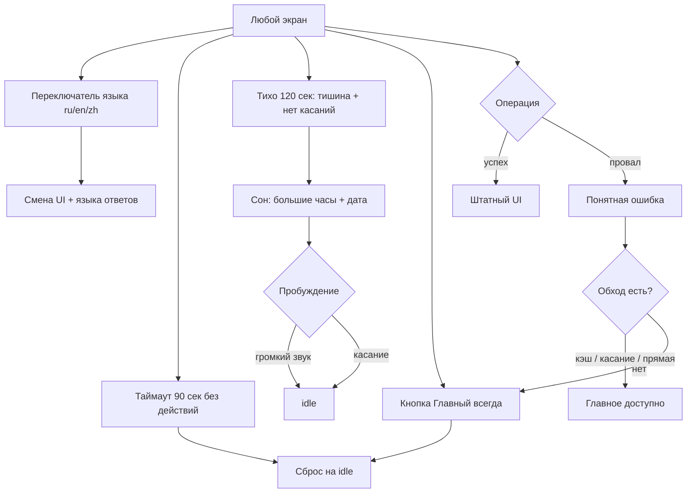

# Флоу 06. Сеанс: языки, сон, ошибки

> 🔒 Заморожено. Правки только через техлида (@Dyman17). Изменение 24.09: спящий режим, поле lang в ошибках, события аналитики.

Покрывает все остальные флоу.

## Флоучарт

## Спящий режим

- Уход: уровень ниже (порог − 15) дольше 120 сек + нет касаний → `session/end`, сброс, часы
- Часы: HH:MM (мигающее двоеточие), дата, «подойдите или коснитесь»
- Выход: звук выше порога → idle; касание → idle

## События аналитики (для дашборда)

Фронт шлёт `POST /api/event`: `place_view` (карточка), `route_click` (маршрут), `scene_open` (сцена). `voice_query`, `qr_scan`, `session_start` пишет сам бэк. Типы вне списка → `400 BAD_REQUEST`.

## Контракт

- `POST /api/event` `{ session_id, type, place_id?, lang }` → `{ ok: true }`
- `POST /api/session/end` `{ session_id }` → `{ ok: true }` (опц., фронт может сбрасываться локально)
- `GET /api/health` → `{ status, db, route_provider, ai, version }`
- Ошибки: `{ error: { code, message, lang, details } }` — поле `lang` добавлено 24.09

## Таблица деградации

| Ситуация | Поведение |
|----------|-----------|
| STT не понял | error_speech + «выбрать на карте» |
| Нет сети / API down | баннер + каталог из кэша |
| Routing упал | прямая + `is_approximate` + пометка |
| Нет сцены | кнопка TarihSky скрыта |
| Нет места по голосу | текстовый ответ + похожие |
| Нет HuskyLens/микрофона | полный режим касания + текст |

## DoD куска

Сеанс сбрасывается по таймауту и кнопке, сон/пробуждение работают, язык переключается везде, каждая ошибка имеет обход, события летят в БД.
