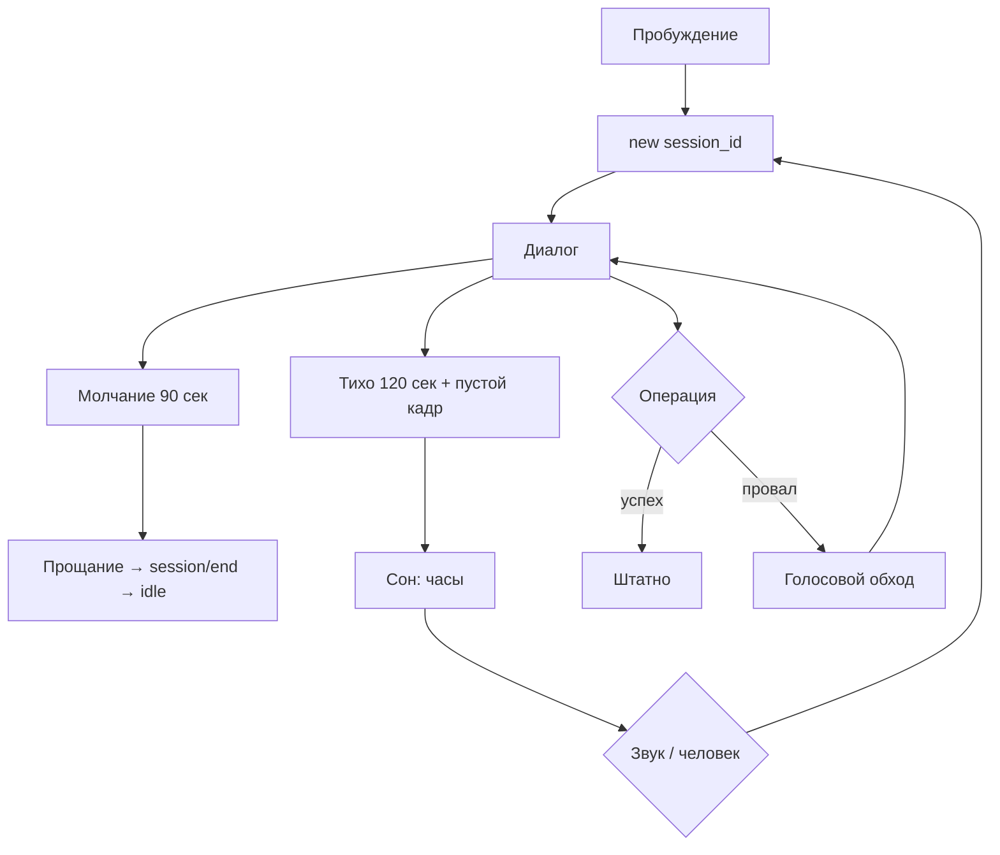

# Флоу 06. Сеанс, сон, ошибки

> 🔒 Заморожено. Правки только через техлида (@Dyman17).

Покрывает все флоу. Касаний нет: будильник — звук/камера.

## Точные правила

| # | Правило |
|---|---------|
| 1 | `session_id` (uuid) генерирует фронт при пробуждении, один на человека |
| 2 | Молчание 90 сек → прощание → `session/end` → idle |
| 3 | Тихо 120 сек + никого в кадре → сон: часы HH:MM + дата + голосовая подсказка раз в 5 мин |
| 4 | Пробуждение: звук выше порога или человек в кадре → idle (не запись сразу) |
| 5 | События в БД на каждое действие (для дашборда): пишет фронт (`place_view`, `route_click`, `scene_open`) и бэк (`voice_query`, `qr_scan`, `session_start`) |
| 6 | Ошибки: `{ error: { code, message, lang, details } }`; у каждой — голосовой обход |

## Флоучарт

## Таблица деградации

| Ситуация | Поведение |
|----------|-----------|
| STT не понял (×2) | «назовите по буквам / покажите» |
| Нет сети / API down | голосовое предупреждение + последний кэш витрины |
| Routing упал | прямая + «примерный путь» вслух |
| Нет сцены | «истории пока нет» вслух |
| Нет места | ответ + 2–3 похожих вслух |
| Нет микрофона/камеры | текстовый фолбэк техлида (не UI туриста) |

## Контракт

- `POST /api/event` `{ session_id, type, place_id?, lang }` → `{ ok: true }`
- `POST /api/session/end` → `{ ok: true }`
- `GET /api/health` → `{ status, db, route_provider, ai, version }`

## DoD куска

Сон/пробуждение, сброс памяти, события в БД, каждый провал озвучен с обходом.
