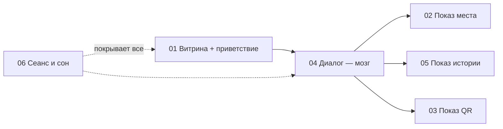

# 🧩 Флоу по функционалам — BaGdar

> 🔒 **ЗАМОРОЖЕНО.** Менять файлы `docs/flows/` может только техлид (@Dyman17).

Говорящий стенд: не сенсорный монитор + микрофон + динамик + камера. Касаний нет вообще. Единственный пульт — диалог с ИИ (Флоу 04). Остальные флоу — показы по командам диалога.

## Сквозная схема

## Куски

| # | Файл | Функционал | Фронт | Бэк |
|---|------|------------|-------|-----|
| 01 | [01-map-catalog.md](01-map-catalog.md) | **Главный: шаги → экран → речь → страницы** | @yernurge | @RKydyrali |
| 02 | [02-place-route.md](02-place-route.md) | Показ места + маршрут | @yernurge | @RKydyrali |
| 03 | [03-qr.md](03-qr.md) | Показ QR | @yernurge | @RKydyrali |
| 04 | [04-voice.md](04-voice.md) | **Диалог, память, жесты** | @yernurge | @RKydyrali |
| 05 | [05-tarihsky.md](05-tarihsky.md) | Показ «тогда/сейчас» | @yernurge | @RKydyrali |
| 06 | [06-session.md](06-session.md) | Сеанс, сон, ошибки | @yernurge | @RKydyrali |

## Правила стыка

- Мозг: `POST /api/dialog/turn` (форма на утверждении, см. 04). Показы: `places/route/scene/qr` — без изменений
- Фронт исполняет список `actions` из ответа диалога, ничего не решает сам
- Касание отсутствует как класс: пробуждение — звук/камера
- Ошибка любого куска не роняет остальные (см. 06)

## Статусы

| Кусок | Фронт | Бэк | Интеграция |
|-------|-------|-----|------------|
| 01 | ⬜ | ⬜ | ⬜ |
| 02 | ⬜ | ⬜ | ⬜ |
| 03 | ⬜ | ⬜ | ⬜ |
| 04 | ⬜ | ⬜ | ⬜ |
| 05 | ⬜ | ⬜ | ⬜ |
| 06 | ⬜ | ⬜ | ⬜ |
