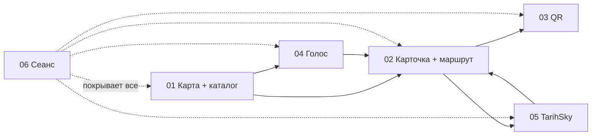

# 🧩 Флоу по функционалам — BaGdar

> 🔒 **ЗАМОРОЖЕНО.** Менять файлы `docs/flows/` может только техлид (@Dyman17). Агентам запрещено править флоучарты и контракты кусков — несоответствие → вопрос техлиду.

Общий файл. Каждый функционал — отдельный файл: флоучарт + контракт + ответственность.

## Сквозной сценарий (как куски стыкуются)

## Куски

| # | Файл | Функционал | Фронт | Бэк |
|---|------|------------|-------|-----|
| 01 | [01-map-catalog.md](01-map-catalog.md) | Карта + каталог, поиск касанием | @yernurge | @RKydyrali |
| 02 | [02-place-route.md](02-place-route.md) | Карточка + маршрут + стрелка | @yernurge | @RKydyrali |
| 03 | [03-qr.md](03-qr.md) | QR на телефон | @yernurge | @RKydyrali |
| 04 | [04-voice.md](04-voice.md) | Голос: язык, intent, ответ | @yernurge | @RKydyrali |
| 05 | [05-tarihsky.md](05-tarihsky.md) | «Тогда и сейчас» | @yernurge | @RKydyrali |
| 06 | [06-session.md](06-session.md) | Языки, таймауты, ошибки | @yernurge | @RKydyrali |

## Правила стыка

- Контракт куска = истина. Полные JSON — в [../api-flow.md](../api-flow.md)
- Фронт не ходит во внешние API, бэк не меняет ответы молча
- Ошибка любого куска не роняет остальные (см. 06)
- HuskyLens — только приветствие, после стабильного MVP

## Статусы

| Кусок | Фронт | Бэк | Интеграция |
|-------|-------|-----|------------|
| 01 | ⬜ | ⬜ | ⬜ |
| 02 | ⬜ | ⬜ | ⬜ |
| 03 | ⬜ | ⬜ | ⬜ |
| 04 | ⬜ | ⬜ | ⬜ |
| 05 | ⬜ | ⬜ | ⬜ |
| 06 | ⬜ | ⬜ | ⬜ |
