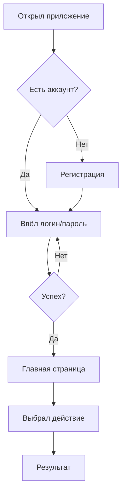

# 👤 Пользовательский сценарий

Как пользователь проходит по приложению от входа до результата.

## Основной флоучарт

## Экраны

| # | Экран | Описание |
|---|-------|----------|
| 1 | Логин | Ввод данных |
| 2 | Регистрация | Создание аккаунта |
| 3 | Главная | Основной экран |
| 4 | Результат | Вывод данных |

---

_Перерисуй под кейс — mermaid прямо здесь, в этом .md_
